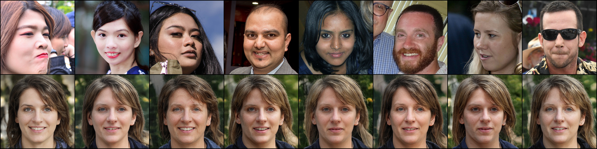
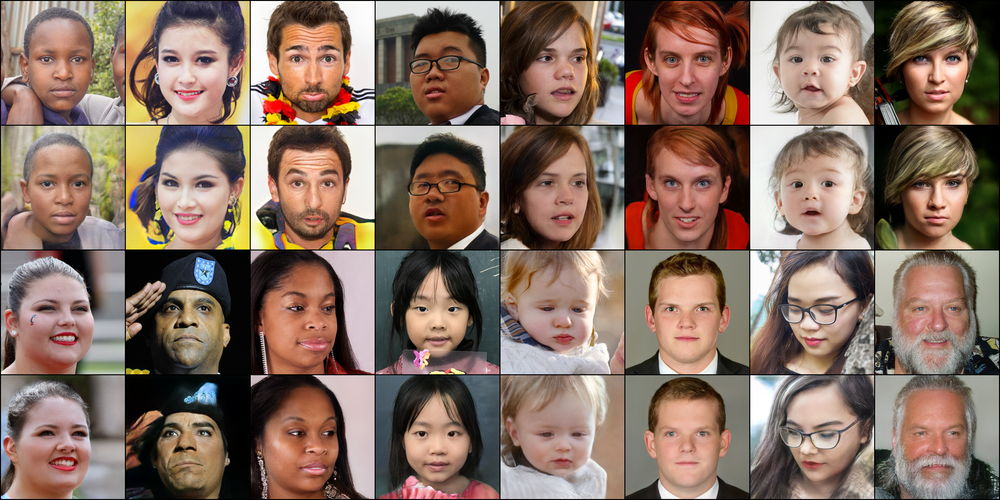
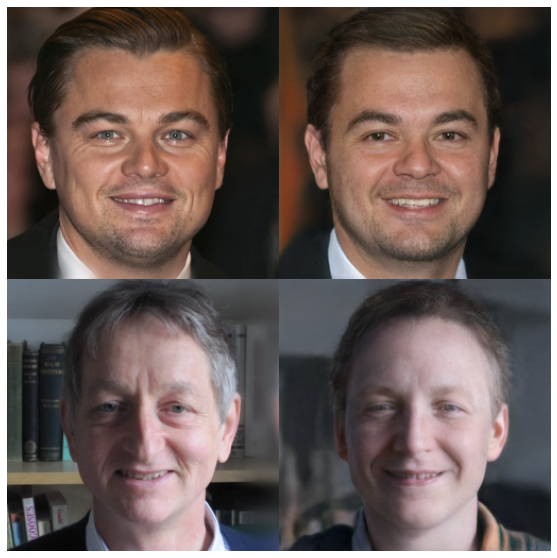
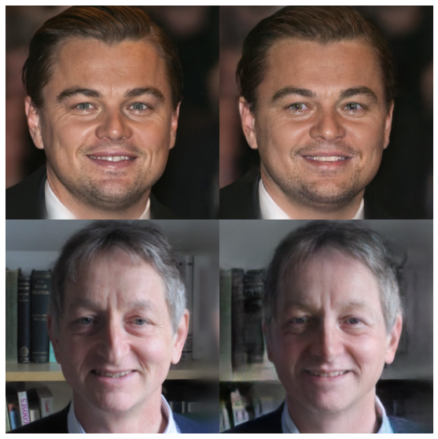
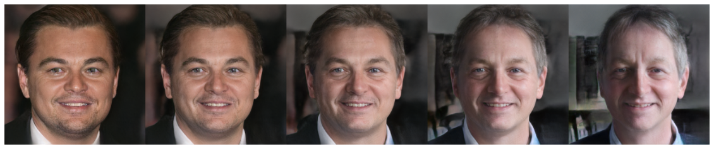
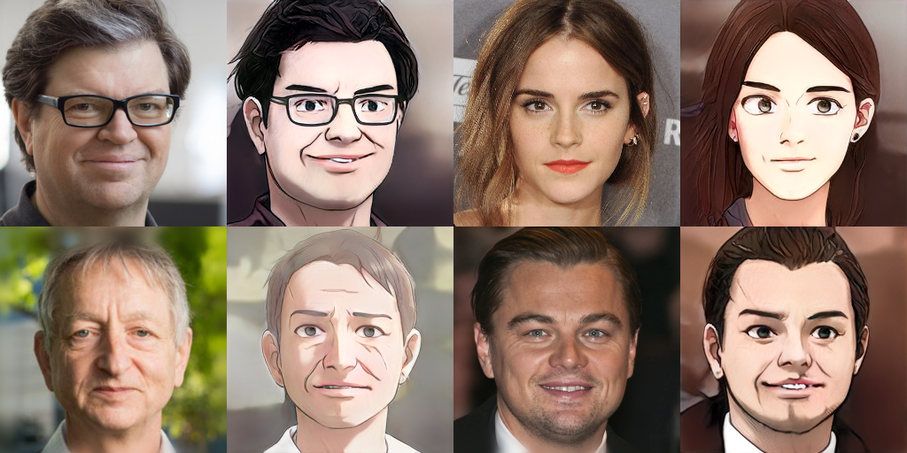

# In-Domain GAN Inversion for Real Image Editing


Based on **Seonghyeon Kim's Pytorch Implementation of StyleGAN2**

[[Paper](https://arxiv.org/pdf/2004.00049.pdf)] [[Official Code](https://github.com/genforce/idinvert)] [[StyleGAN2 Pytorch](https://github.com/rosinality/stylegan2-pytorch)]

## Train Encoder

```
python train_encoder.py
```

**0k iter**\


**1M iter**\
\
[[encoder checkpoint](https://drive.google.com/file/d/1QQuZGtHgD24Dn5E21Z2Ik25EPng58MoU/view?usp=sharing)] [[generator checkpoint](https://drive.google.com/file/d/1TH77dUsqcq50htIZT6DljFYr4T_ziJli/view)]

**Note:** The encoder architecture and loss weights are different from the original implemetation.


## Interpolation

```
interpolate.ipynb
```

**Domain-Guided Encoder (Initial projection)**\


**In-Domain Inversion (500 steps)**\


**Inperpolation Result**\


## Encoder + Model Interpolation
[[Paper](https://arxiv.org/abs/2010.05334)] [[Naver Webtoon Model](https://github.com/bryandlee/naver-webtoon-faces#stylegan2)]




