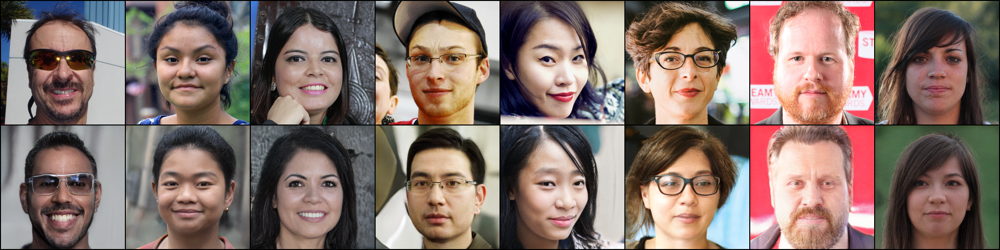

# stylegan2-encoder-pytorch

Implementation of **In-Domain GAN Inversion for Real Image Editing** based on **Seonghyeon Kim's Pytorch Implementation of StyleGAN2**

[[Paper](https://arxiv.org/pdf/2004.00049.pdf)] [[Official Code](https://github.com/genforce/idinvert)] [[StyleGAN2 Pytorch](https://github.com/genforce/idinvert)]

#### Domain-Guided Encoder

**0k iter**\

**160k iter**\
 

**Note:** The encoder architecture and loss weights are different from the original implemetation.